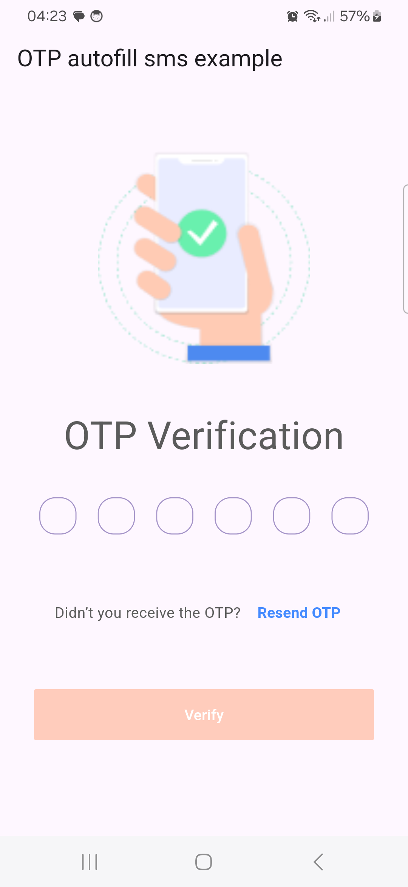
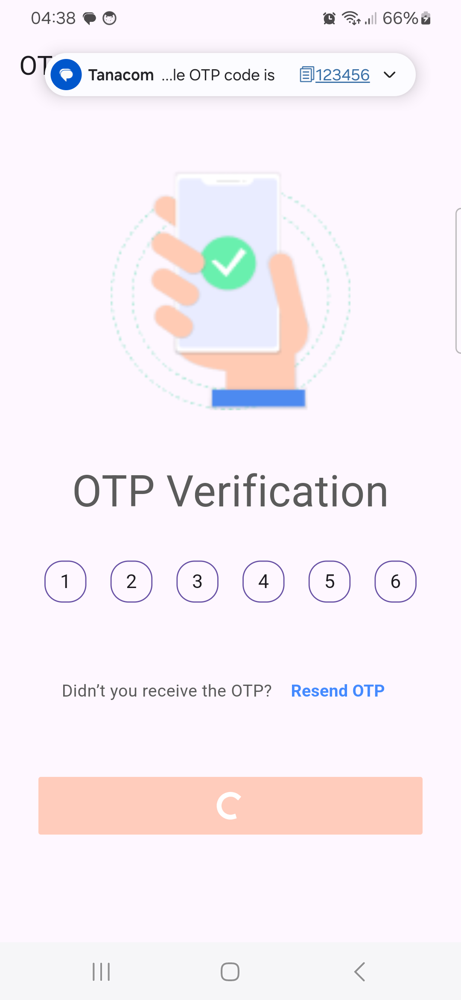

# otp_autofill_sms

`otp_autofill_sms` is a Flutter plugin designed to simplify OTP (One-Time Password) autofill for
Android applications.

This plugin is available only for Android, as iOS handles OTP autofill natively. While iOS users
benefit from built-in OTP autofill functionality, this plugin provides a seamless experience for
Android users by managing OTP autofill without requiring SMS read permissions, thus enhancing user
convenience.

## Features

- **Automatic OTP Detection**: Automatically captures and fills OTPs sent via SMS, enhancing user
  convenience.

- **No SMS Permissions Required**: Utilizes
  the [SMS User Consent API](https://developers.google.com/identity/sms-retriever/user-consent/overview)
  to function without needing explicit SMS read permissions.
- **Easy Integration**: Simple setup and integration with your Flutter project.

## Screenshots

| Default Screen                   | OTP Autofill                     |
|----------------------------------|----------------------------------|
|  |  |

## How It Works

The plugin leverages Google's SMS Retriever API to detect OTPs automatically. To ensure proper
detection, the SMS message must adhere to specific formatting rules:

### SMS Formatting Guidelines

- **Length**: SMS should be no longer than 140 bytes.

- **Content**: The message must contain a one-time code for user verification.

- **End String**: The message should end with an 11-character hash string that identifies your app.

### Example SMS Format

> Your ExampleApp code is: 915456 FA+9qCVSz

**Make sure to generate the Signature Code for both the release and debug versions of your app and append it to your message.**


## Installation

To add `otp_autofill_sms` to your Flutter project, follow these steps:

1. **Add Dependency**: Include the plugin in your `pubspec.yaml` file:
    ```yaml
    dependencies:
      otp_autofill_sms: ^1.0.0
    ```

2. **Install Packages**: Run `flutter pub get` to fetch the package.

3. **Android Configuration**: Follow the setup instructions below to configure your Android project.

## Setup Instructions

1 **Flutter Integration**: Import and initialize the plugin in your Dart code:
```dart
import 'package:otp_autofill_sms/otp_autofill_sms.dart';
```

2 **Basic Usage**:
```dart

     // Get the app signature code.
     Future<void> _getSignatureCode() async {
        String? signature = await OtpAutofillSms.getAppSignature();

          print("Signature: $signature");
        
      }
   
   
    // Start listening for incoming SMS messages
      void _startListeningSms() {
        OtpAutofillSms.startListeningSms().then((message) {
          setState(() {
       
          print("Message: $message");

          });
        });
      }
      
 ```
    

## Contributing

Contributions are welcome! If you find any bugs or have ideas for improvements, please submit a pull
request or open an issue on
the [otp_autofill_sms repository](https://github.com/TandohAnthonyNwiAckah/otp_autofill_sms)
    

